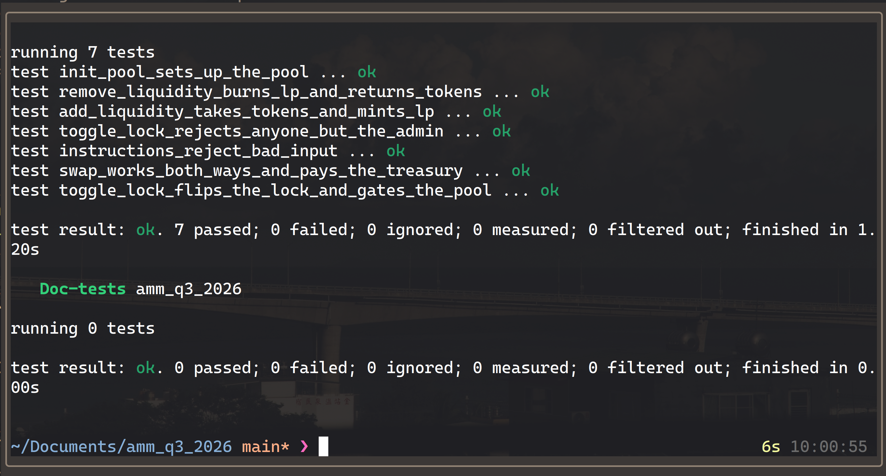

# amm_q3_2026

A constant-product (`x · y = k`) automated market maker on Solana, built with Anchor.
Anyone can open a pool for a pair of SPL tokens, provide liquidity for LP tokens, and
swap one side for the other. Every swap charges a fee split between liquidity
providers and a protocol treasury.

Program ID: `4ZRnPnXswZz8Ub7VByDzHiEGj7Bq8TzijafufN1tk4Rf`

## How it works

```
                ┌──────────────── Pool (PDA) ────────────────┐
                │ seed · admin · treasury · mint_a · mint_b  │
                │ lp_fee_bps · protocol_fee_bps · locked     │
                └──┬──────────────┬──────────────┬───────────┘
                   │ authority    │ authority    │ mint authority
               vault_a (ATA)  vault_b (ATA)   mint_lp (PDA)
```

- **Pool** is a PDA of `["pool", seed]`, so one program can host many pools for the
  same pair. It owns both vaults and is the mint authority of the LP mint, a PDA of
  `["lp", pool]`.
- **Treasury** is any wallet, chosen when the pool is created. Its token accounts for
  both mints are created up front, so a swap never has to create an account.

## Instructions

| Instruction        | Args                                 | What it does                                                                                                  |
| ------------------ | ------------------------------------ | ------------------------------------------------------------------------------------------------------------- |
| `init_pool`        | `seed, lp_fee_bps, protocol_fee_bps` | Creates the pool, LP mint, both vaults and both treasury accounts. The signer becomes the admin.               |
| `add_liquidity`    | `lp_amount, max_a, max_b`            | Mints exactly `lp_amount` LP, priced at the current ratio and capped by the maximums. The first deposit sets the ratio. |
| `remove_liquidity` | `lp_amount, min_amt_a, min_amt_b`    | Burns LP and returns the pro-rata share of both vaults. Works even while the pool is locked.                   |
| `swap`             | `is_a, amount_in, min_out`           | Swaps A for B when `is_a` is true, otherwise B for A. Fails if the output falls below `min_out`.               |
| `toggle_lock`      | none                                 | Admin only. Flips the lock. While locked, `add_liquidity` and `swap` are refused so LPs can still exit.        |

## Fees and the treasury

Both fees are basis points of the swap input, set per pool and capped so their sum
cannot exceed 100%.

- The **LP fee** stays in the vault. It never leaves the pool, so `k` grows and every
  LP token becomes worth slightly more.
- The **protocol fee** is transferred to the treasury's token account for the input
  mint, so fee revenue accrues in whichever token the trader spent.

```
net_in       = amount_in · (10_000 − lp_fee_bps − protocol_fee_bps) / 10_000
amount_out   = reserve_out − k / (reserve_in + net_in)
protocol_fee = amount_in · protocol_fee_bps / 10_000     → treasury
the remainder of what the trader paid                    → vault (the LP fee)
```

## Curve math

The arithmetic comes from Dean Little's
[constant-product-curve](https://github.com/deanmlittle/constant-product-curve):
`ConstantProduct::init` and `swap` price a trade, `xy_deposit_amounts_from_l` prices
an LP mint, and `xy_withdraw_amounts_from_l` prices an LP burn. `CurveError` maps onto
`AmmError` through a `From` impl, so no result is unwrapped.

The swap handler always passes the input side to the curve as `LiquidityPair::X`,
reordering the reserves for a B to A trade. The crate applies the fee only on its X
path, so using `LiquidityPair::Y` would price that direction fee-free and let every
B to A swap shrink `k` at the LPs' expense.

## Layout

```
programs/amm_q3_2026/src
├── lib.rs                entrypoints
├── state.rs              Pool account
├── constants.rs          seeds, basis points, LP decimals, precision
├── error.rs              AmmError
├── instructions.rs       module re-exports
└── instructions/
    ├── init_pool.rs
    ├── add_liquidity.rs
    ├── remove_liquidity.rs
    ├── swap.rs
    └── toggle_lock.rs
programs/amm_q3_2026/tests/amm.rs    integration tests
```

## Build and test

Requires Rust 1.89, Solana CLI 3.x and Anchor CLI 1.0.

```bash
anchor build && cargo test
```

Tests run against the compiled program inside
[LiteSVM](https://github.com/LiteSVM/litesvm), so no validator is needed. `anchor build`
must come first, because the test file embeds the built `.so`.



Seven tests cover every instruction:

| Test                                         | Covers                                                                        |
| -------------------------------------------- | ----------------------------------------------------------------------------- |
| `init_pool_sets_up_the_pool`                 | stored config, LP mint authority, vaults and treasury accounts created         |
| `add_liquidity_takes_tokens_and_mints_lp`    | first deposit sets the ratio, the next is priced against it                    |
| `remove_liquidity_burns_lp_and_returns_tokens` | burning half the supply returns half of each vault                          |
| `swap_works_both_ways_and_pays_the_treasury` | both directions, protocol fee reaches the treasury, `k` grows                  |
| `toggle_lock_flips_the_lock_and_gates_the_pool` | lock blocks deposits and swaps, withdrawal still works, toggling again unlocks |
| `toggle_lock_rejects_anyone_but_the_admin`   | a stranger cannot lock the pool                                                |
| `instructions_reject_bad_input`              | bad fees, zero amounts, slippage limits, burning more LP than exists           |

## Notes

Adapted from the Turbin3 [amm_q2_26](https://github.com/ShrinathNR/amm_q2_26)
reference, with different naming and a fee split added. `Config` became `Pool`, the
token sides are `a` and `b`, the optional authority became a required admin, and
`toggle_lock` was added so a pool can be paused without trapping liquidity.

Not audited. There is no minimum-liquidity lock on the first deposit and no oracle,
so treat this as a learning project rather than something to put real funds behind.
